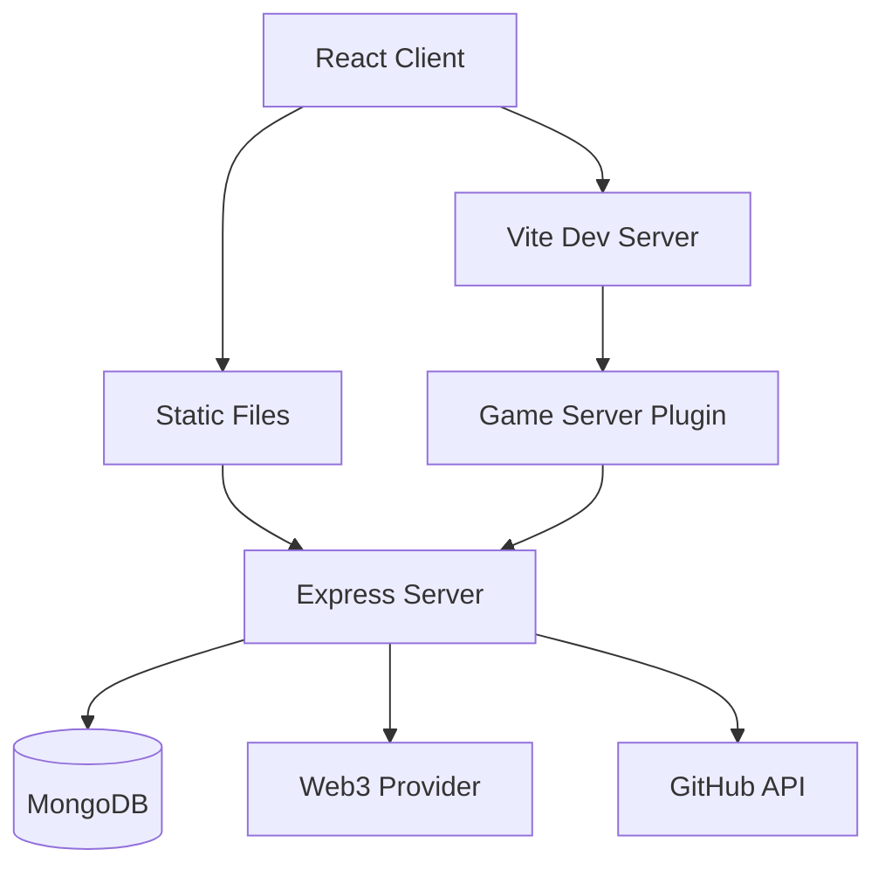

# Architecture Overview

This document describes the high-level architecture of the Geneva Game platform.

## System Components



## Development Mode

In development, the system runs through Vite's development server:

1. **Vite Dev Server**
   - Serves React application with HMR
   - Loads game server plugin
   - Proxies API requests

2. **Game Server Plugin**
   - Integrates with Vite
   - Manages WebSocket connections
   - Handles API routes
   - Connects to external services

3. **External Services**
   - MongoDB for persistence
   - Web3 provider for blockchain interaction
   - GitHub API for project management

## Production Mode

In production, the system runs as a standalone server:

1. **Express Server**
   - Serves static files
   - Handles API routes
   - Manages WebSocket connections
   - Connects to external services

2. **Static Files**
   - Built React application
   - Optimized assets
   - Client-side routing

## Key Subsystems

### 1. Game Engine

- Real-time state management
- Player synchronization
- Physics calculations
- Event handling

### 2. Web3 Integration

- Contract interaction
- NFT management
- Transaction handling
- Event monitoring

### 3. Project Management

- GitHub integration
- Issue tracking
- Project board management
- Automated workflows

## Data Flow

1. **Client-Server Communication**
   - REST API for CRUD operations
   - WebSocket for real-time updates
   - GraphQL for GitHub integration

2. **State Management**
   - Client-side React state
   - Server-side game state
   - Blockchain state
   - Database persistence

3. **Event Processing**
   - WebSocket events
   - Blockchain events
   - GitHub webhooks
   - System events

## Security Architecture

1. **Authentication**
   - Web3 wallet authentication
   - GitHub OAuth (optional)
   - JWT tokens

2. **Authorization**
   - Role-based access control
   - Smart contract permissions
   - API rate limiting

3. **Data Protection**
   - Environment variable encryption
   - Secure WebSocket connections
   - Database access controls

## Scalability Considerations

1. **Horizontal Scaling**
   - Stateless server design
   - Database sharding support
   - Load balancer ready

2. **Performance Optimization**
   - Client-side caching
   - Server-side caching
   - Optimized database queries
   - Efficient WebSocket communication

3. **Resource Management**
   - Connection pooling
   - Memory management
   - Background job processing

## Module Organization

```
src/
├── components/           # React components
│   ├── Game/            # Game-specific components
│   ├── UI/              # Common UI components
│   └── Web3/            # Blockchain components
│
├── server/              # Backend server
│   ├── modules/         # Server modules
│   │   ├── game/        # Game logic
│   │   ├── web3/        # Blockchain integration
│   │   └── github/      # GitHub integration
│   └── config/          # Server configuration
│
└── contracts/           # Smart contracts
    └── interfaces/      # Contract interfaces
```

## Development Workflow

1. **Local Development**
   ```mermaid
   graph LR
       Dev[Developer] --> IDE[VSCode]
       IDE --> Docker[Docker Container]
       Docker --> Vite[Vite + HMR]
       Docker --> DB[(MongoDB)]
   ```

2. **Deployment Flow**
   ```mermaid
   graph LR
       Build[Build] --> Test[Test]
       Test --> Deploy[Deploy]
       Deploy --> Monitor[Monitor]
   ```

## Future Considerations

1. **Scalability**
   - Microservices architecture
   - Serverless functions
   - Edge computing

2. **Features**
   - Enhanced multiplayer capabilities
   - Advanced blockchain integration
   - AI/ML integration

3. **Developer Experience**
   - Improved debugging tools
   - Enhanced monitoring
   - Automated testing